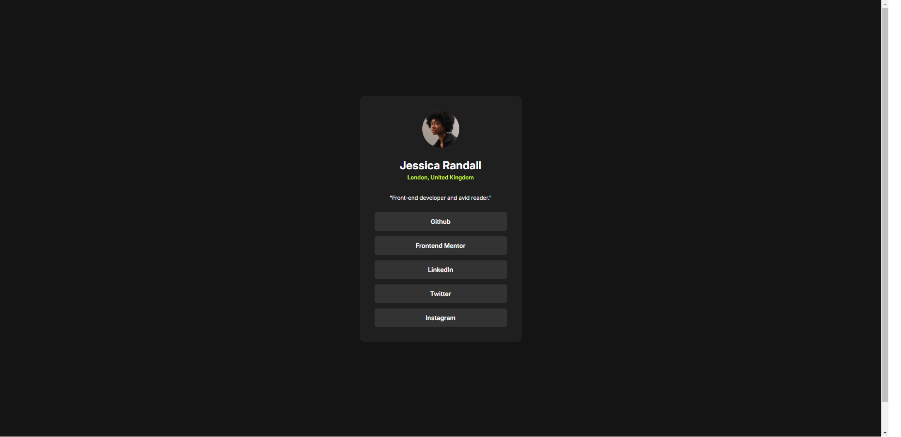

# Frontend Mentor - Social links profile solution

This is a solution to the [Social links profile challenge on Frontend Mentor](https://www.frontendmentor.io/challenges/social-links-profile-UG32l9m6dQ). Frontend Mentor challenges help you improve your coding skills by building realistic projects. 

## Table of contents

- [Overview](#overview)
  - [The challenge](#the-challenge)
  - [Screenshot](#screenshot)
  - [Links](#links)
- [My process](#my-process)
  - [Built with](#built-with)
  - [What I learned](#what-i-learned)
- [Author](#author)

## Overview

### The challenge

Users should be able to:

- See hover and focus states for all interactive elements on the page

### Screenshot

### Links

- Solution URL: [Add solution URL here](https://your-solution-url.com)
- Live Site URL: [Add live site URL here](https://your-live-site-url.com)

## My process

  In this project, I focused on creating a clean, responsive design by using semantic HTML5 for better structure and accessibility. I used CSS custom properties to keep things consistent, especially with colors and font weights, which made it easier to manage and update styles across the project.

  To handle the layout, I used Flexbox for aligning and centering elements within the .container and .card, making everything feel more balanced and adaptable to different screen sizes.

  I also followed a mobile-first workflow, starting with smaller screens and then scaling up. This made sure the design was responsive from the get-go, providing a better experience across all devices.

### Built with

- Semantic HTML5 markup
- CSS custom properties
- Flexbox
- Mobile-first workflow

### What I learned

  In this project, I learned the value of using **semantic HTML5** to create a more structured and accessible website. It helped me understand how proper markup not only makes the code cleaner but also improves readability for both developers and screen readers. Working with **CSS custom properties** also taught me how beneficial it is to define reusable values, especially when maintaining consistency in design, like managing colors and typography.

  By implementing **Flexbox** and **CSS Grid**, I gained more confidence in handling layouts, especially for responsive design. Flexbox made it easier to align and center elements dynamically, while CSS Grid gave me the power to manage more complex layouts without unnecessary hacks. This combination made me realize how flexible and powerful modern CSS techniques can be.

  Lastly, following a **mobile-first workflow** reinforced the importance of prioritizing smaller screens and then progressively enhancing the design for larger devices. This approach not only ensures a better user experience but also simplifies the overall development process by focusing on the essentials first. Overall, this project was a great opportunity to refine my skills in responsive design and modern web development practices.

## Author

- Website - [Neil Fernando](https://neirucode.github.io/portfolio/)
- Frontend Mentor - [@neirucode](https://www.frontendmentor.io/profile/neirucode)
- Twitter - [@yourusername](https://www.twitter.com/yourusername)
